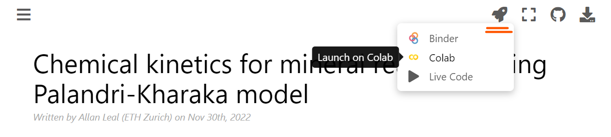
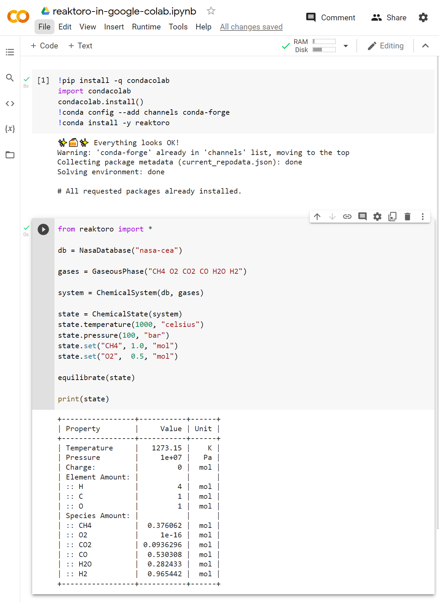

# Installation in Google Colab

You can run Reaktoro on [Google Colab](https://colab.research.google.com/)! You can launch Google Colab from one of the tutorials by clicking the *rocket launcher button* on the top bar of the page as shown below for this [chemical kinetics tutorial](../tutorials/kinetics/kinetics-minerals-using-palandri-kharaka-model.ipynb):

However, it is imperative that a new code cell is added at the top of the notebook containing the following code to install Reaktoro:

~~~
!pip install -q condacolab
import condacolab
condacolab.install_from_url("https://repo.anaconda.com/miniconda/Miniconda3-py38_4.12.0-Linux-x86_64.sh")
!conda config --remove channels defaults
!conda config --add channels conda-forge
!conda install reaktoro -y
~~~

Alternatively, you can also create a new Jupyter notebook in Google Colab and try executing the installation code above. Once it is finished, execute the following in a new code cell:

~~~python
from reaktoro import *

db = NasaDatabase("nasa-cea")

gases = GaseousPhase("CH4 O2 CO2 CO H2O H2")

system = ChemicalSystem(db, gases)

state = ChemicalState(system)
state.temperature(1000, "celsius")
state.pressure(100, "bar")
state.set("CH4", 1.0, "mol")
state.set("O2",  0.5, "mol")

equilibrate(state)

print(state)
~~~

Here is a [shared link to a Google Colab notebook](https://colab.research.google.com/drive/13UsI3Tj0ZRX6ea8_xoezry6mO0Ghq-vV?usp=sharing) demonstrating the above instructions. Below is a screenshot showing the expected result of this guide when following the previous instructions (with cleared installation output for the first cell because it is too long!):

# Please help me installing Reaktoro!

If you had any problems with the instructions above (or for some reason this is not working at the moment), [please contact us](mailto:allan.leal@erdw.ethz.ch).
